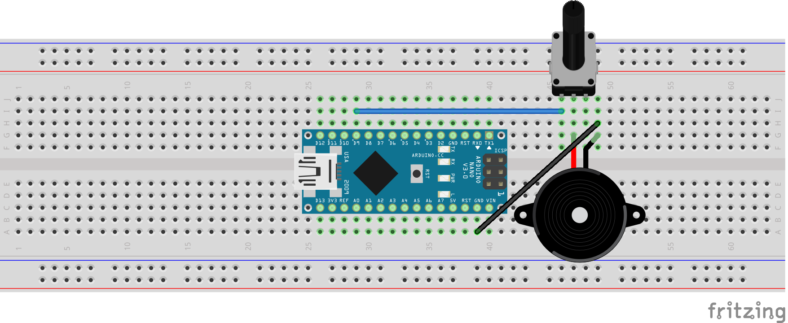

# Arduino Intermediate Workshop - Sound

- [Diagram](README.md#diagram)
- [Functions](README.md#functions)
  - [readNote](README.md#readnote)
  - [playNote](README.md#playnote)
  - [playNoteTime](README.md#playnotetime)
  - [playFreq](README.md#playfreq)
  - [turnOff](README.md#turnoff)


## Diagram


  

## Functions


#### readNote

```c++
void readNote();
```

Uses the Serial Monitor on the Arduino IDE to play notes.

Each note is played by entering a letter corresponding to a note followed by the octave to play.
- Available notes are: A, B, C, D, E, F, & G. 
- Octaves are between 0 - 10.
- Sharps and flats can be played by entering a 'b' or 's' after the note letter.

Examples:

Middle C: C4
5th octave Bb (B Flat): Bb5
8th octave Fs (F Sharp): Fs8

-----------------------


#### playNote

```c++
void playNote(char note, unsigned int mod, unsigned int octave);
```

Plays a given note indefinitely. This follows musical notation.

- **note:** A single character for the note to be played. Available notes are: A, B, C, D, E, F, & G.
- **mod:** Note modifier (Sharp and Flat). 
  - 0 - No modifier
  - 1 - Make the note sharp (higher pitch)
  - 2 - Make the note flat (lower pitch)
- **octave:** The octave the note should be in. Range is 0 - 10. Middle C is C4.

------------------------


#### playNoteTime

```c++
void playNoteTime(char note, unsigned int mod, unsigned int octave, unsigned int durationMS);
```

Same as [playNote](README.md#playNote), but only plays for a given duration.

- **duration:** Time to play the note in milliseconds.

------------------------


#### playFreq

```c++
void playFreq(float frequency);
```

Plays a frequency for an undetermined amount of time. 0 Will turn the sound off.
Range 1 - 25k Hz.

- **frequency:** The frequency (in Hz) of the sound to be played.

------------------------


#### turnOff

```c++
void turnOff();
```

Turns the sound off.
